# Metasploitable2 Report

## Introduction

### Setup
I started by creating a Metasploitable2 VirtualBox VM.
- Metasploitable2 VM IP address: 10.0.2.4

After doing some research I found that many people use Kali Linux to do their penetration testing on Metasploitable2, so I also created a Kali Linux VirutalBox VM. 
I also learned that a free version of Nessus can be used to perform a scan on Metasploitable2 to highlight any vulnerabilties that I may be able to exploit, so I went 
ahead and installed Nessus on my Kali Linux VM.

  

Once it was up and running I did a basic network scan as well as an advanced network scan on the Metasploitable2 IP address 10.0.2.4 with each scan both returning approximately 72 vulnerabilities.

When looking through some of the critical and high severity results I discovered that some of them mention how the vulnerability may be exploited, and many listed you could use metasploit, so I installed metasploit on the Kali Linux VM and decided to give it a try.

## Exploiting the Vulnerabilities

### UnrealIRCd Backdoor Detection
Description: The remote IRC server is a version of UnrealIRCd with a backdoor that allows an attacker to execute arbitrary code on the affected host.
- vulnerability found from Nessus

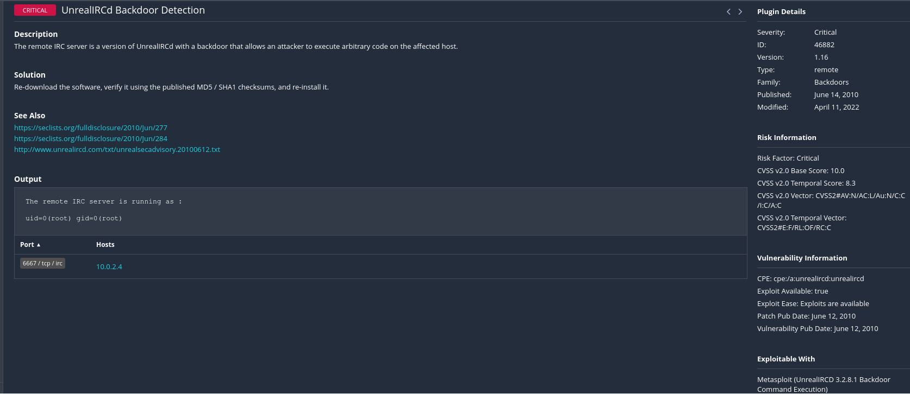

UnrealIRCD is an open source interent relay chat daemon and happens to be the most popular IRC server with over 40% of the market share.
With the use of my nmap scan on the Metasploitable2 IP address I found that for this specific vulnerability the ports I could exploit were ports 6667 or 6697.

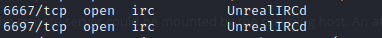

To begin I started up metasploit and did a search for unreal to find the unrealIRCD exploit. After that I looked at the options for the exploit and found that I needed to set the target host and that the target port was already set to 6667 which I found from the nmap scan. After doing some research I learned this exploit may not have a payload built into it so I looked at the payload options and learned that the bind_ruby option gives you the highest privilege so that's what I used. I learned that the payload should listen for a connection and then spawn a command shell once exploited and once I set the payload and ran exploit it worked and opened a command shell on the remote machine. Once I got the shell I ran a couple of commands to show that I had root privilege and also included the encrypted root user passsword from the /etc/shadow file.

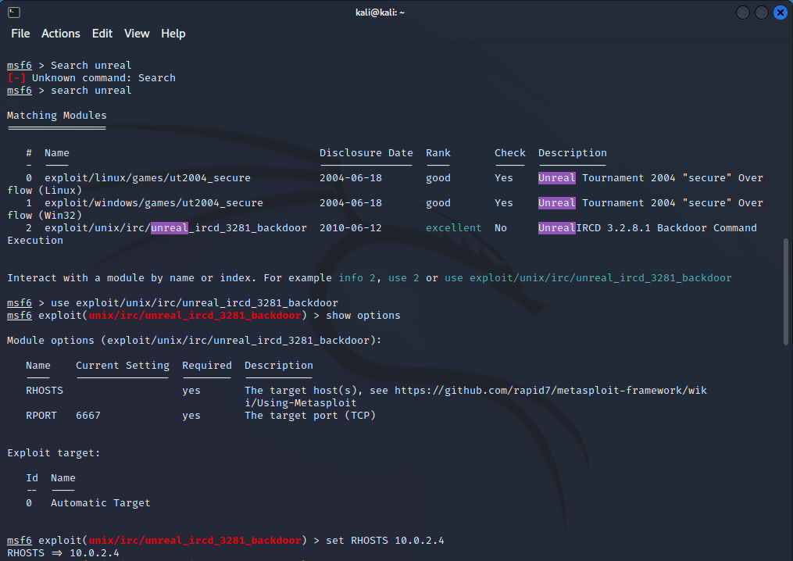
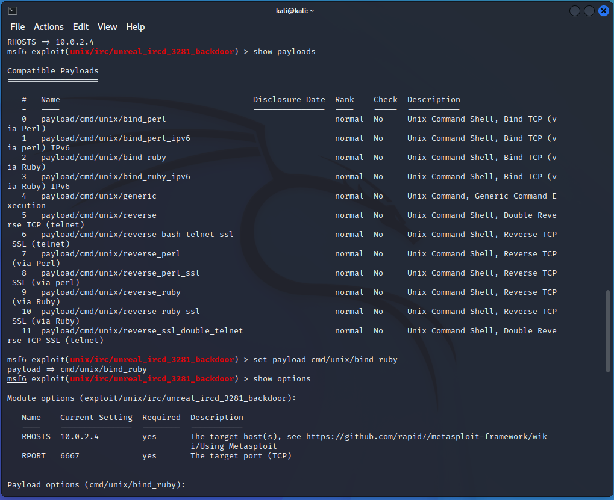
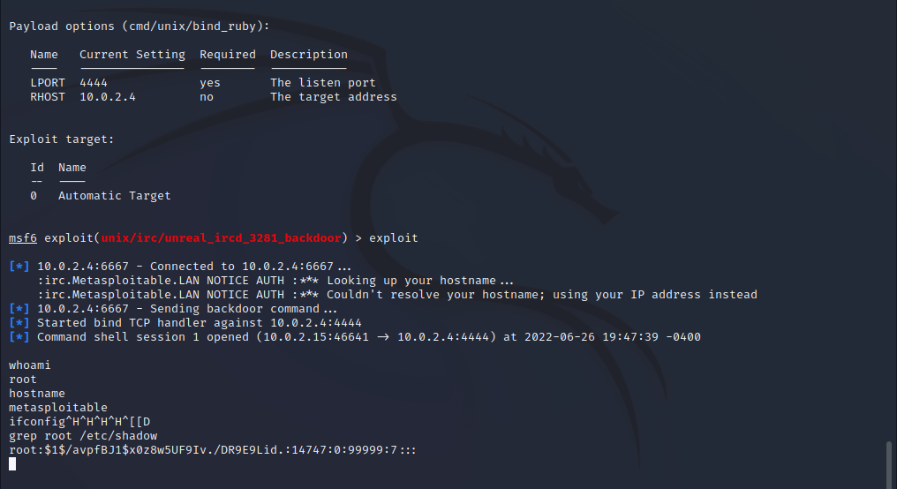

### Exploiting Port 139 & 445 (Samba)
Description: Metasploitable2 is using Samba version 3.0.20, which allows an attacker to execute arbitrary commands, by specifying a username containg shell meta characters.

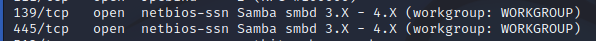

For this exploit I started up metasploit and did a search for samba to find the correct exploit. After that I looked at the options for the exploit and found that I needed to set the target host and that the target port was already set to 139 but since 445 was also listed in the nmap scan I decided to set the target port to 445 instead. After setting the target host and the port I ran exploit and was able to get another shell with root privilege and was able to run ifoncifg as well as show that I was the root user.

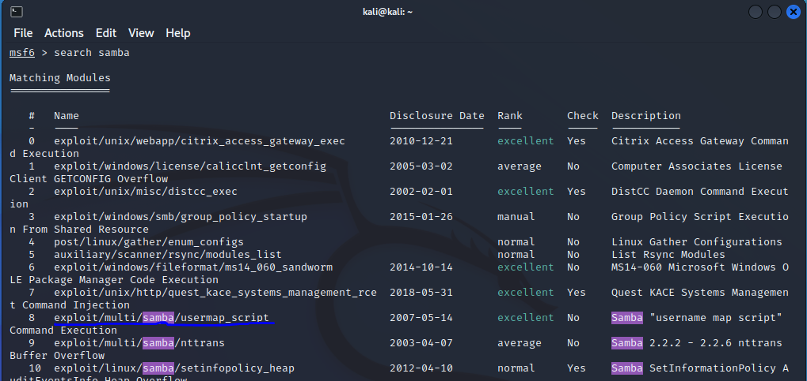
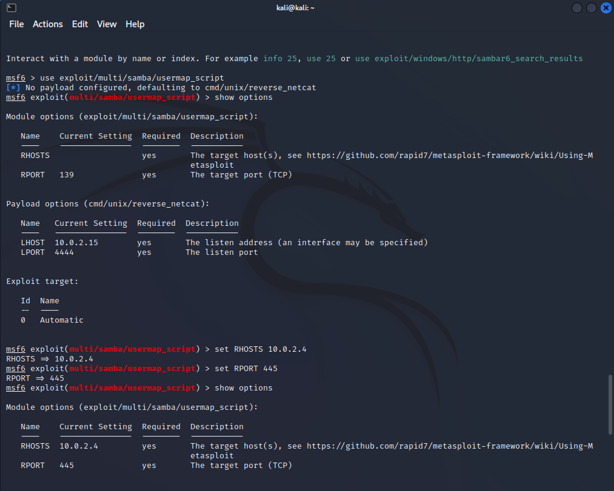
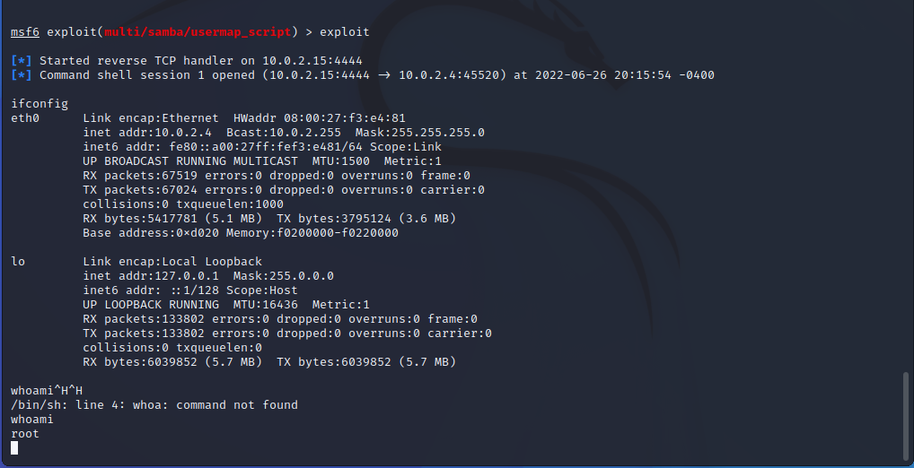

### Exploiting TELNET
Description: This module will test a telnet login on a range of machines and report successful logins.

For this exploit I created a users file as well as a passwords file shown below with some basic usernames and passwords and placed it on my desktop. After starting up metasploit I began the telnet_login vulnerability and looked at the options to set everything up. I changed the target host to the Metasploitable2 VM, set stop on success and vebose to true, and also set the user_file and the pass_file to take the files I created on my desktop. Once I hit run it iterated throguh the list trying each user and password combination and stopped once it got the correct match which spawned a shell where I was able to run a couple commands as the msfadmin user.

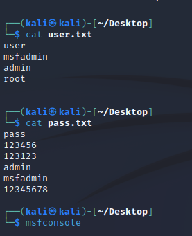
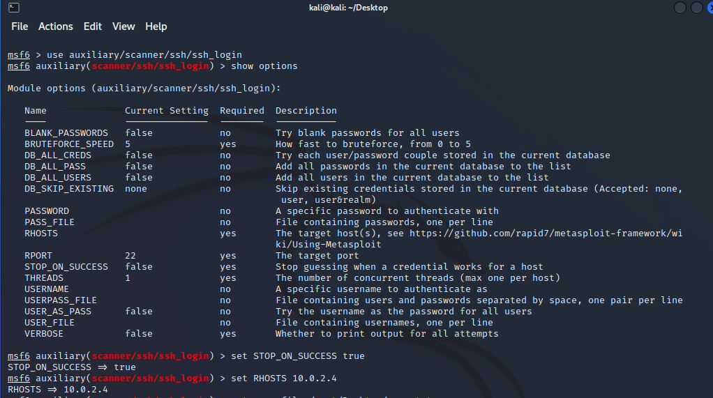
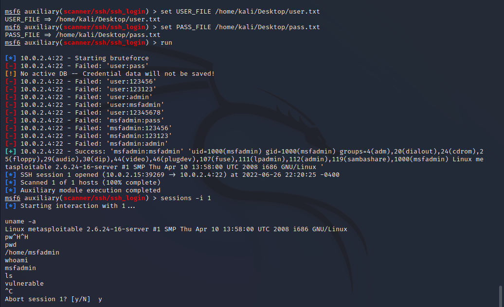

### NFS Exported Share Information Disclosure
Description: At least one of the NFS shares exported by the remote server could be mounted by the scanning host. An attacker may be able to leverage this to read (and possibly write) files on remote host.
- vulnerability found from Nessus

NFS stands for network file system and helps to share files and folders between systems, it also enables you to mount a remote share locally. This all depends on remote procedure calls or RPC service which is controlled by the rpcbind service. In order to find the ports that control rpcbind and NFS I ran an nmap scan on the Metasploitable2 IP address and found that for this specific vulnerability the ports I could exploit were ports 111 for rpcbind and port 2049 for NFS.

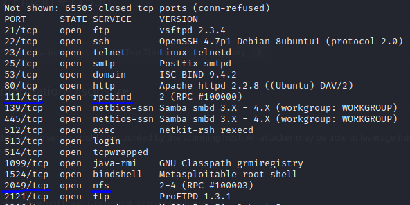

Shown below I learned that I'd be able to mount to the root filesystem, so I planned to create an ssh key on my attacking machine(Kali VM), mount to the nfs, and then add my key to the root users account authorized keys file, this process is shown below. Unfortunately for this exploit I was unable to successfully ssh into the Metasploitable2 VM. From the examples I found my proccess should've worked but for some reason I was still prompted for a password even though I left the ssh passphrase as empty, but I will keep tinkering with it to see if I can eventually ssh in, this was jsut as far as I got!

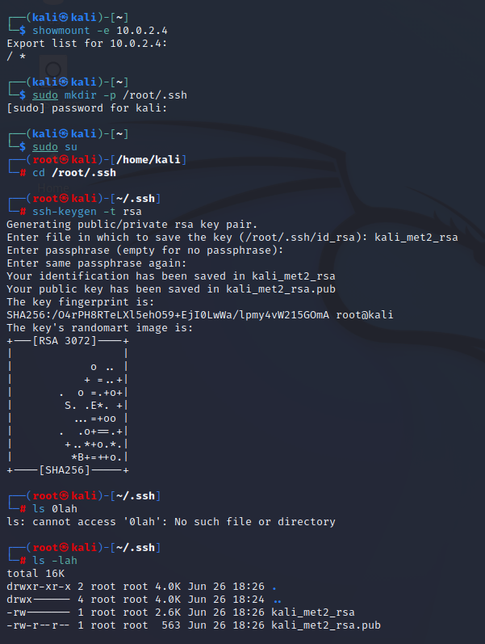
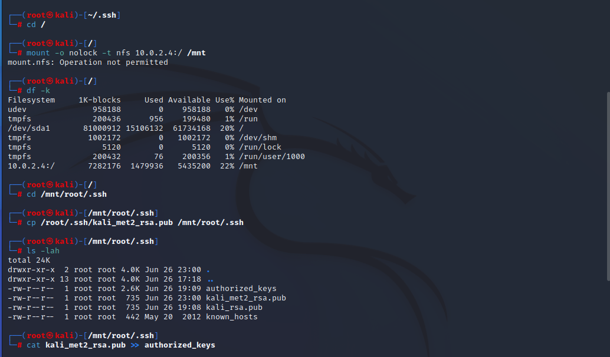
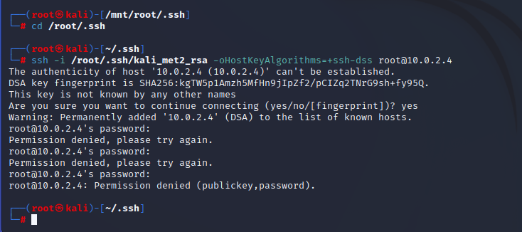

## DVWA

### Command Execution
Description: The purpose of the command injection attack is to inject and execute commands specified by the attacker in the vulnerable application. In situation like this, the application, which executes unwanted system commands, is like a pseudo system shell, and the attacker may use it as any authorized system user. However, commands are executed with the same privileges and environment as the application has. Command injection attacks are possible in most cases because of lack of correct input data validation, which can be manipulated by the attacker (forms, cookies, HTTP headers etc.).
- Example: 10.0.2.4 | whoami and 10.0.2.4 | pwd

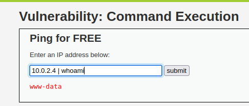
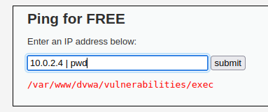

### SQL Injection
Description: A SQL injection attack consists of insertion or "injection" of a SQL query via the input data from the client to the application. A successful SQL injection exploit can read sensitive data from the database, modify database data (Insert/Update/Delete), execute administration operations on the database (such as shutdown the DBMS), recover the content of a given file present on the DBMS file system and in some cases issue commands to the operating system. SQL injection attacks are a type of injection attack, in which SQL commands are injected into data-plane input in order to effect the execution of predefined SQL commands.
- The 'id' variable within this PHP script is vulnerable to SQL injection.

Here is an exmaple of a normal entry of 1 which returns user 1 from the database.

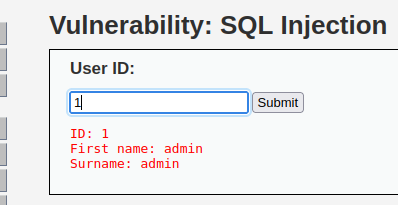

Here is an example of SQL Injection by closing off the statement with the quote ' and then adding a Union statement to also select the user and their password from the users table.

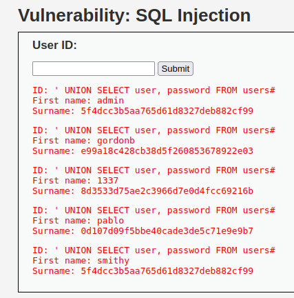

### File Upload
Description: Uploaded files represent a significant risk to applications. The first step in many attacks is to get some code to the system to be attacked. Then the attack only needs to find a way to get the code executed. Using a file upload helps the attacker accomplish the first step.

For this one I made a little php script shown below called new.php and saved it to my desktop so that I could then upload it to the DVWA.

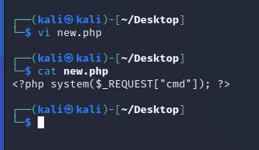
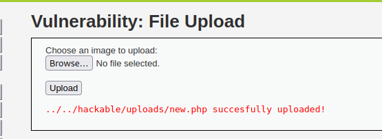

After uploading the file successfully I copied the file location and appended it to the search after /upload. After hitting go it borught me to the page but there was an error stating that the system function couldn't execute a blank command so back in the bar after new.php I added the command that I wanted which in this example was just ls, and after hitting go again I got the list of files within the uploads directory. The process is shown below.

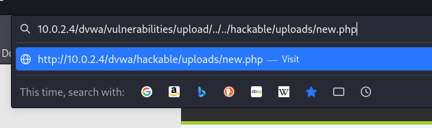
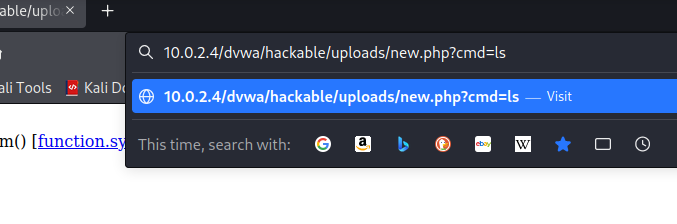
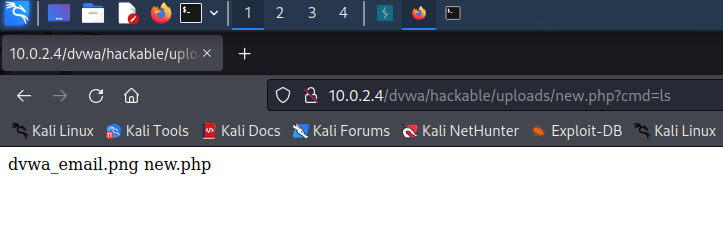

## Conclusion
Overall I find Metasploitable2 very interesting to mess around on and practice penetration testig with. I think this was very helpful to practice what I learned in college and to push myself to see what I could figure out on my own and with the help of some research. I plan to keep on exploiting more vulnerabilities and tessting my knowledge on how penetration testing works. Thank you for challenging me with this project and report, it was a great refresher on Linux/Github and I appreciate the opportunity to show you my passion!
