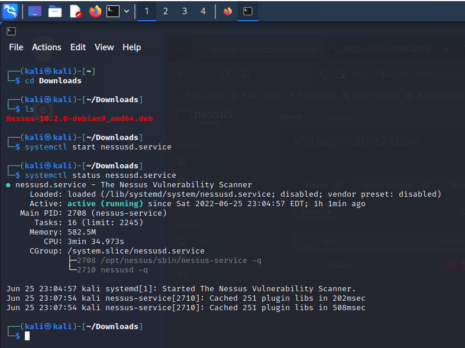
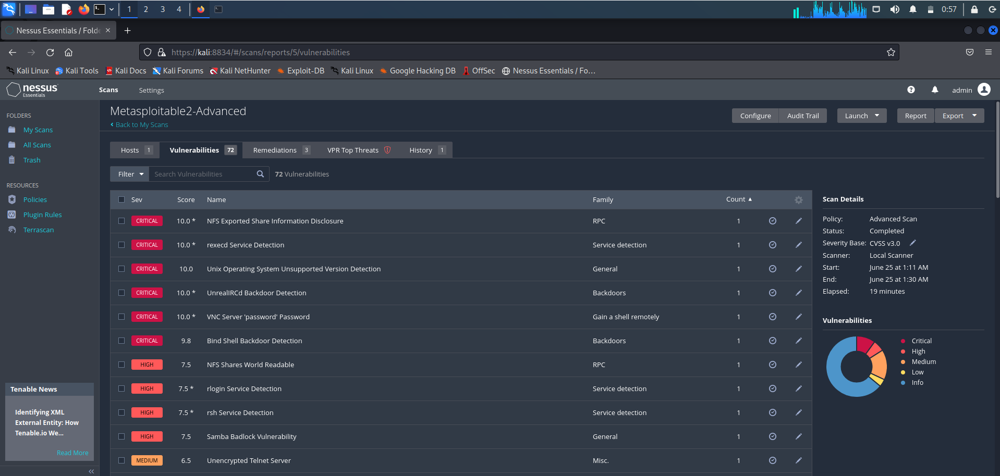
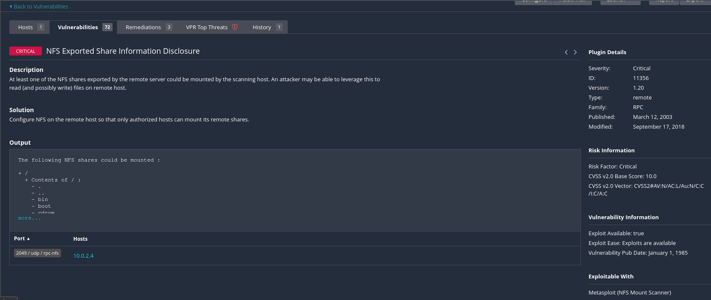

# Metasploitable2 Report

### Introduction

I started by creating a Metasploitable2 VirtualBox VM.
- Metasploitable2 VM IP address: 10.0.2.4

After doing some research I found that many people use Kali Linux to do their penetration testing on Metasploitable2, so I also created a Kali Linux VirutalBox VM. 
I also learned that a free version of Nessus can be used to perform a scan on Metasploitable2 to highlight any vulnerabilties that I may be able to exploit, so I went 
ahead and installed Nessus on my Kali Linux VM.

  

Once it was up and running I did a basic network scan as well as an advanced network scan with both returning ~ 72 vulnerabilities.

When looking through some of the critical and high severity results I discovered that some of them mention how the vulnerability can be exploited and many listed you could use metasploit so I installed metasploit on the Kali Linux VM and decided to give it a try.

### NFS Exported Share Information Disclosure

Description: At least one of the NFS shares exported by the remote server could be mounted by the scanning host. An attacker may be able to leverage this to read (and possibly write) files on remote host.

